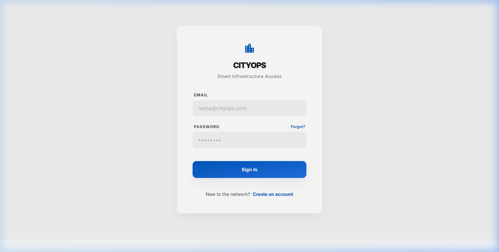
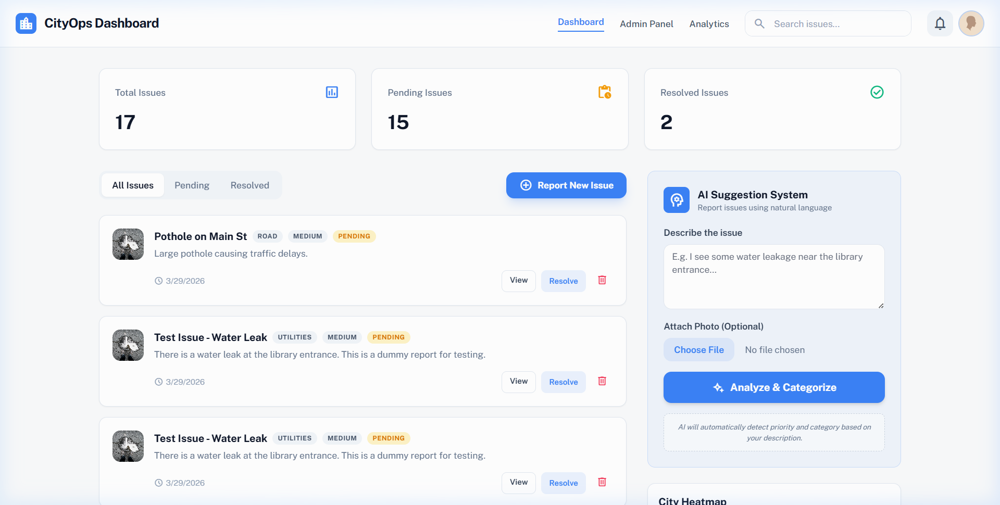
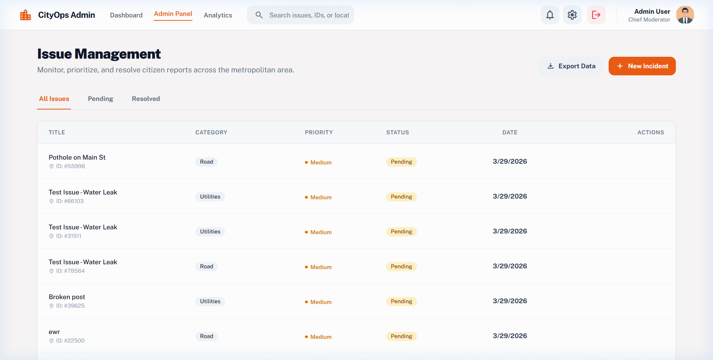
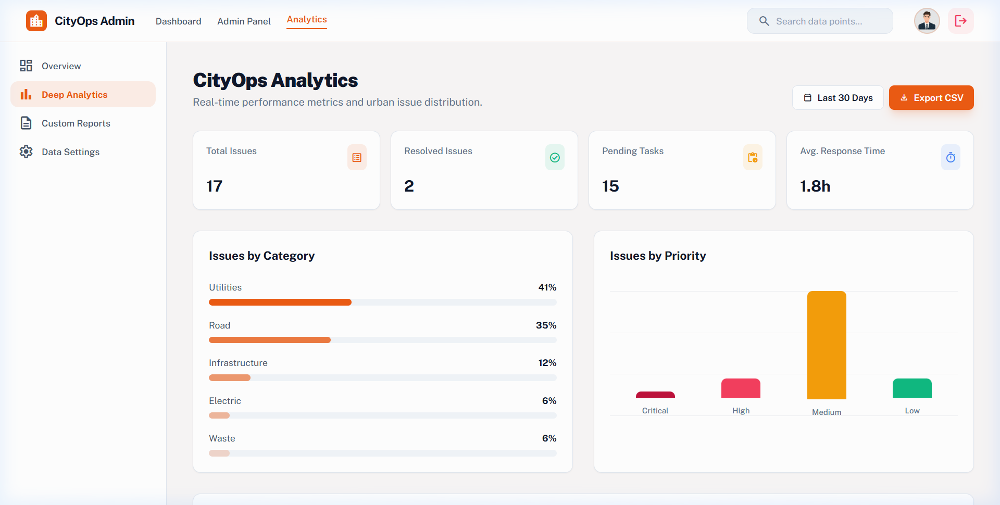
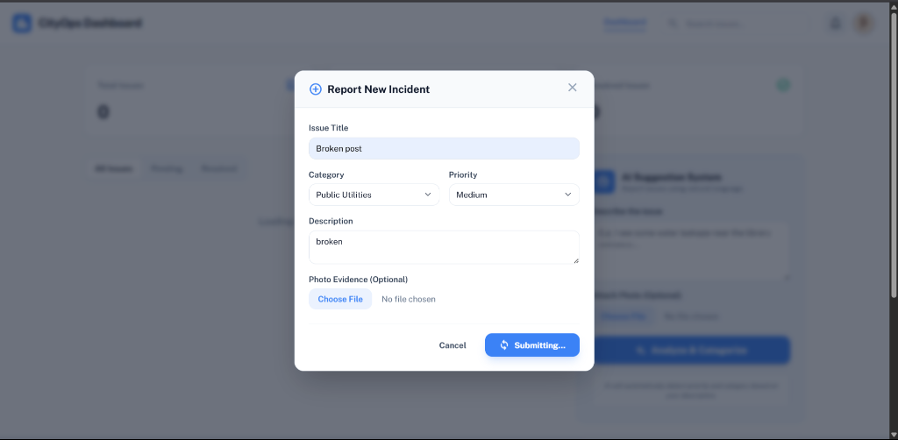
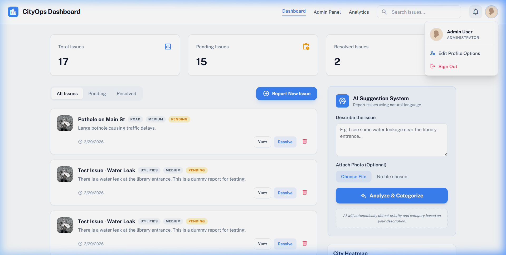

# 🏙️ CityOps — Smart City Issue Management System

> A full-stack web platform for citizens to report, track, and manage urban infrastructure issues — featuring AI-powered categorization, role-based access control, and a modern dashboard UI.

**🥈 2nd Prize Winner** at the **Vibe Coding Event**, TecXell 2026 — Muthoot Institute of Technology, Kochi.

---

## 📸 Screenshots

### 🔐 Login Page
Secure, branded authentication portal with the centered-minimal design.



### 📊 Citizen Dashboard
Real-time statistics, issue feed with filters, AI suggestion system, and city heatmap — all in one view.



### 🛠️ Admin Panel
Tabular issue management with inline resolve/delete actions, search, status filters, and CSV export.



### 📈 Analytics
Category distribution charts, priority breakdown, and key performance metrics at a glance.



### 📝 Report New Incident Modal
A rich form modal with title, category, priority, description, and photo upload support.



### 🚪 Custom Logout Modal
A professional, animated Tailwind CSS confirmation modal that replaced the native browser dialog for a seamless sign-out experience.



---

## ✨ Features

### 🧠 AI-Powered Issue Reporting
- Natural language issue description with automatic **category & priority detection**
- Supports categories: Road & Transport, Public Utilities, Sanitation & Waste, Electric & Lighting
- Smart keyword-based analysis engine that simulates AI behaviour

### 📊 Real-Time Dashboard
- Live statistics — Total, Pending, and Resolved issue counts
- Filter issues by status (All / Pending / Resolved)
- Full-text search across issue titles and descriptions
- City heatmap visualization

### 🛠️ Admin Panel
- Tabular view of all reported issues with inline actions
- Resolve or delete issues directly from the table
- Search and filter controls with resolution rate tracking
- **CSV data export** for offline analysis

### 📈 Analytics
- Category distribution bar chart
- Priority breakdown visualization (Critical / High / Medium / Low)
- Dynamic, data-driven charts rendered in real time
- Average response time metrics

### 📋 Issue Details Page
- Detailed view for each issue with photo evidence, coordinates, and full description
- Activity timeline with assignment tracking
- One-click resolve and delete actions

### 🔐 Authentication & Security
- Branded **Login** and **Registration** pages with centered-minimal Stitch templates
- **Role-Based Access Control (RBAC)** — Admin vs. standard user
  - Admin users see all navigation links (Dashboard, Admin Panel, Analytics)
  - Standard users are restricted from `/admin` and `/analytics` routes
  - Dynamic UI hides admin-only navigation links for regular users
- **Route Guards** — unauthenticated users are redirected to `/login`
- **Custom Logout Modal** — animated Tailwind CSS confirmation dialog (replaces native `window.confirm`)
- Persistent session via `localStorage` with dynamic username injection

### 📸 Image Upload
- Attach photo evidence when reporting issues
- Base64 image preview before submission

### 📤 Data Export
- Client-side CSV generator for Dashboard and Admin panels
- One-click export of all visible issue data

---

## 🛠️ Tech Stack

| Layer        | Technology                            |
|--------------|---------------------------------------|
| **Frontend** | HTML, TailwindCSS (CDN), Vanilla JS   |
| **Backend**  | Node.js, Express.js                   |
| **Data**     | JSON file-based storage               |
| **Auth**     | Session-based with localStorage + RBAC |
| **Fonts**    | Google Fonts (Inter, Public Sans)     |
| **Icons**    | Material Symbols Outlined             |

---

## 📂 Project Structure

```
smart-city-issue-management/
├── assets/                 # Screenshots for documentation
│   ├── dashboard.png
│   ├── admin.png
│   ├── analytics.png
│   ├── login.png
│   ├── logout_modal.png
│   └── report_modal.png
├── client/
│   ├── index.html          # Main citizen dashboard
│   ├── admin.html          # Admin management panel
│   ├── analytics.html      # Analytics & charts page
│   ├── details.html        # Individual issue detail view
│   ├── login.html          # Login page (Stitch template)
│   ├── register.html       # Registration page (Stitch template)
│   ├── script.js           # All frontend logic (API calls, rendering, auth, modals)
│   └── style.css           # Custom styles
├── server/
│   └── server.js           # Express.js backend (API routes, mock AI, auth)
├── data/
│   ├── issues.json         # JSON data store for issues
│   └── users.json          # User credentials & roles
├── package.json
└── README.md
```

---

## 🚀 Getting Started

### Prerequisites
- [Node.js](https://nodejs.org/) (v16 or higher)

### Installation

```bash
# Clone the repository
git clone https://github.com/JiphinGeorge/smart-city-issue-management.git
cd smart-city-issue-management

# Install dependencies
npm install

# Start the server
node server/server.js
```

The app will be running at **http://localhost:3000**

### Demo Credentials

| Role  | Email               | Password    |
|-------|---------------------|-------------|
| Admin | admin@cityops.com   | admin123    |
| User  | user@cityops.com    | user123     |

> New users can also register via the **Create an account** link on the login page.

---

## 📡 API Endpoints

| Method   | Endpoint           | Description                              |
|----------|--------------------|------------------------------------------|
| `GET`    | `/api/issues`      | Fetch all issues with summary stats      |
| `POST`   | `/api/issues`      | Create a new issue                       |
| `PUT`    | `/api/issues/:id`  | Update an issue (e.g., resolve)          |
| `DELETE` | `/api/issues/:id`  | Delete an issue                          |
| `POST`   | `/api/analyze`     | AI-based category & priority suggestion  |
| `POST`   | `/api/login`       | User authentication                      |
| `POST`   | `/api/register`    | User registration                        |

---

## 🔒 Security Architecture

```
┌─────────────┐     ┌──────────────┐     ┌─────────────────┐
│  Login Page │────▶│  /api/login   │────▶│  users.json     │
│  (Stitch)   │     │  POST        │     │  (credentials)  │
└─────────────┘     └──────────────┘     └─────────────────┘
       │                    │
       ▼                    ▼
┌─────────────┐     ┌──────────────┐
│ localStorage│     │ Role Check   │
│ (session)   │     │ admin/user   │
└─────────────┘     └──────────────┘
       │                    │
       ▼                    ▼
┌─────────────────────────────────────────┐
│          enforceSecurityAndUI()         │
│  • Route Guards (redirect if unauth)   │
│  • RBAC (hide admin links for users)   │
│  • Dynamic username injection          │
└─────────────────────────────────────────┘
```

> **Note:** The current implementation uses `localStorage` for session state. For production environments, this should be upgraded to **JWTs or server-side sessions** with httpOnly cookies.

---

## 👥 Team

- **Jiphin George** — [GitHub](https://github.com/JiphinGeorge)
- **Umesh**

---

## 🏆 Acknowledgements

Built during the **Vibe Coding Event** at **TecXell 2026**, Muthoot Institute of Technology, Kochi.
A big thank you to the organizers and volunteers for hosting such an amazing event! 👏

---

## 📄 License

This project is open source and available under the [MIT License](LICENSE).
